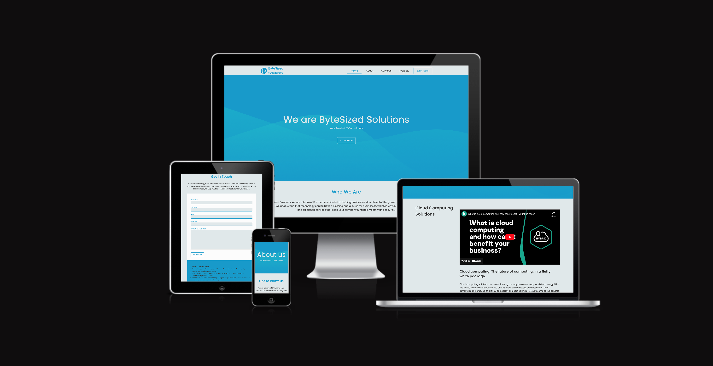

# ByteSyzed Website
Bytesized is a technology company that offers innovative solutions for businesses looking to increase efficiency and productivity. Our website serves as a platform for showcasing our various products and services, which include cloud computing solutions, data management, and IT consulting. Our team of experts leverages the latest technology to provide tailored solutions that meet the unique needs of each of our clients. With a focus on customer satisfaction, we strive to deliver the highest quality services and support to help businesses reach their full potential. Visit our website to learn more about how Bytesized can support your business.

The Bytesized website provides businesses with a comprehensive platform for their technology needs. It offers a range of IT services and solutions to help businesses improve their technology infrastructure and drive business success. The website is designed with a clean and intuitive interface, making it easy for visitors to find the information they need.

Live link: [ByteSized Solutions Website](https://iojones.github.io/bytesizedconsultancy/index.html)

Here are some of the key components of the Bytesized website:

## Features 
### Homepage:

Clean and intuitive navigation
Cards showcasing company services and their benefits
YouTube video demonstrating the impact of incorporating IT on businesses
Contact form for visitors to request information or consultation
Footer with navigation links to about us, services, case studies, and contact pages.
About us page:

- Detailed information about Bytesized's services
- Insight into the company's expertise and experience

### Services page:

- - In-depth look at the range of services and solutions provided by Bytesized
- Overview of the benefits of each service, including cloud computing, data analytics, and cyber security
- Information on how each service can improve technology infrastructure and drive business success

### Projects page:

- Real-world examples of how Bytesized has helped businesses overcome technology challenges
- Insights into the positive impact Bytesized has had on various companies' technology infrastructure
- Inspiration for visitors' own technology journeys

### Contact form:

- Available throughout the website
- Convenient way for visitors to get in touch with Bytesized
- Allows visitors to ask questions, request consultations, or provide feedback

### Existing Features

- __Navigation Bar__

  - Featured on all pages, the full responsive navigation bar includes links to the Logo, Home page, Gallery and Sign Up page and is identical in each page to allow for easy navigation.
  - This section will allow the user to easily navigate from page to page across all devices without having to revert back to the previous page via the ‘back’ button. 

- __Footer__

  - Featured on all pages, the full responsive navigation bar includes links to the Logo, Home page, Gallery and Sign Up page and is identical in each page to allow for easy navigation.
  - This section contains links that allow the user to easily navigate from page to page across all devices without having to revert back to the previous page via the ‘back’ button. 

- __Form__
    Accesible via a cta on all pages in footer and header.

### Features Left to Implement

- Signup for newsletter
- Drop down menu for pages with sub pages, for example the service page.
- -A simple blog for news
- Sticky Live chat
- User Prefers Dark/Light mode for easy switching between themes.
Embed videos to different pages instead of images for better conversion of visitors.

## Testing 
The site was tested on the following browsers:
- Opera
- Firefox
- Microsoft Edge
- Chrome and na few layout bugs were spotted.

During testing, layout errors were spotted and were fixed with the help of W3 checker and Chrome dev tools for debugging.

### Validator Testing 

- HTML
  - No errors were returned when passing through the official [W3C validator](https://validator.w3.org/nu/?doc=https%3A%2F%2Fcode-institute-org.github.io%2Flove-running-2.0%2Findex.html)
- CSS
  - No errors were found when passing through the official [(Jigsaw) validator](https://jigsaw.w3.org/css-validator/validator?uri=https%3A%2F%2Fvalidator.w3.org%2Fnu%2F%3Fdoc%3Dhttps%253A%252F%252Fcode-institute-org.github.io%252Flove-running-2.0%252Findex.html&profile=css3svg&usermedium=all&warning=1&vextwarning=&lang=en#css)

## Deployment

This section should describe the process you went through to deploy the project to a hosting platform (e.g. GitHub) 

- The site was deployed to GitHub pages. The steps to deploy are as follows: 
  - In the GitHub repository, navigate to the Settings tab 
  - From the source section drop-down menu, select the Master Branch
  - Once the master branch has been selected, the page will be automatically refreshed with a detailed ribbon display to indicate the successful deployment. 

The live link can be found here - [ByteSized Solutions Website](https://iojones.github.io/bytesizedconsultancy/index.html)

After deployment, I encountered issues with images missing. Upon troubleshooting, I found that all links in the code must be typed with relative links i.e <pre><code> "./" or "../"

</code></pre> for root folder and to trasverse out of a folder relaive to the current folder respectively.

## Credits 

### Content 

- The text/ website copy was generated using Chat GPT. [Chat GPT](https://chatgptonline.net)
- 2D Vector images in the services page was gotten from [FreePik](https://freepik.com)
- The mobile nav icon was taken from [Font Awesome](https://fontawesome.com/)
- The icons in the header and body were gotten from [SVG Repo](https://www.svgrepo.com)

### Media

- The photos used on the home page, projects page, and case study page are from [Pexels](https://www.pexels.com).
- The wave background in the hero, CTA banner and footer was generated using [SVGWave](https://svgwave.in).

##  Tech Stack
-   This website was written in HTML5 and CSS3.
-   I also wrote a script to automate my git commit and push actions to save valuable time. See below:

<pre><code>#! /bin/bash
echo "enter commit message: "
read commitMessage
git add *
git commit -m "$commitMessage"
git push
</code></pre>

